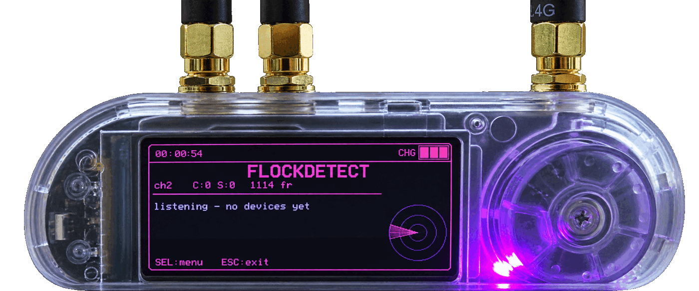
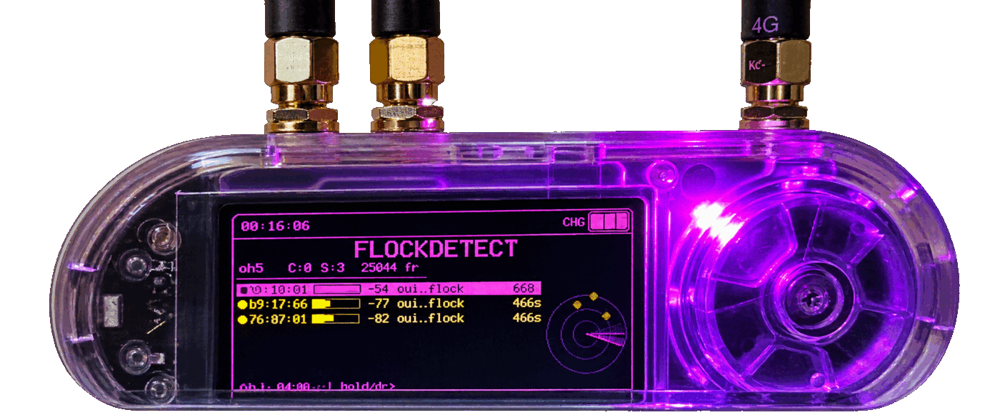

<p align="center">
  
  
</p>

# FlockDetect

A fork of the [Bruce](https://github.com/BruceDevices/firmware) ESP32 firmware that adds
**FlockDetect** — a passive detector for Flock Safety ALPR gear and related surveillance
devices, built for the **LilyGO T-Embed CC1101** (ESP32-S3, 16 MB flash / 8 MB PSRAM).

Everything Bruce already does is still here. This fork adds one module,
`src/modules/wifi/flock_detect.{h,cpp}`, reachable from two menu entries:

- `WiFi → FlockDetect`
- `Bluetooth → FlockDetect BLE`

Detection is **passive receive only** — the module never transmits.

<p align="center">
  <a href="https://deviratechllc.github.io/flockdetect-firmware/">
    
  </a>
</p>

<p align="center">
  <sub>Flashes straight from the browser over Web Serial — no esptool, no Python.<br>
  Needs desktop Chrome, Edge or Opera; Firefox and Safari don't implement Web Serial.</sub>
</p>

---

## Status

**Working.** Detection has been validated in the field against known Flock Safety
cameras cross-referenced with [DeFlock](https://deflock.me), and it flags them
successfully.

The build also ships diagnostic pages that expose the whole capture pipeline — frame
counters at every stage, the IE signatures computed from wildcard probes, and every
source heard regardless of tier. Those exist so results can be checked rather than
taken on trust, and so a quiet session can be told apart from a broken one.

---

## How it detects

Four independent vectors feed a tiered **CONFIRMED / SUSPICIOUS / INFO** model.
CONFIRMED fires an alert takeover with buzzer and LED; SUSPICIOUS and INFO are
list-only.

| Vector | Signal |
|---|---|
| IE signature | Information-Element fingerprint of a Flock camera's wildcard probe request |
| SSID patterns | `Flock-XXXXXX`, `test_flck`, `Penguin-<10 digits>`, `FS Ext Battery`, `flock`/`flck` substrings |
| Hidden SSID | Beacons with an empty SSID element from a Flock-family OUI, deduplicated per BSSID |
| OUI tables | Flock, SoundThinking/ShotSpotter, and surveillance-camera vendor prefixes |

BLE adds Raven acoustic-sensor service UUIDs (with a firmware-generation estimate),
Flock-family device names, and the XUNTONG `0x09C8` manufacturer ID.

Detections can be logged to SD as CSV, optionally GPS-tagged.

---

## Diagnostics

`SEL → Diagnostics`. Then **SEL** cycles pages, **Up/Dn** scrolls, **ESC** returns to
the list.

1. **Capture chain** — a counter at every boundary from the promiscuous callback
   through the ring buffer, the parser, and the classifier. If `rx all` is 0 the radio
   callback never fired; if `localMacRej` is high while `cand oui` is 0 the target is
   MAC-randomizing; if `ringHigh` approaches the ring size, frames are being dropped.
2. **IE signatures** — the signatures actually computed from wildcard probes, recorded
   *before* the match test so a near-miss against the expected constant is visible
   rather than silently discarded.
3. **All sources** — every management-frame source heard this session regardless of
   tier, with its real OUI. This is how a target's MAC surfaces when it never scores.

With `SD Log: ON`, a companion `flockdiag_*.csv` is written alongside the detection log
for offline analysis — useful because the device is normally flashed over USB rather
than kept on a serial console. Both logs carry the 802.11 **sequence number**, which
keeps counting through MAC randomisation and so can tie a randomising device back to a
single radio.

---

## Scan channels

`SEL → Scan ch` picks how wide the sweep goes. The setting survives leaving and
re-entering the module.

| Preset | Sweep | Use |
|---|---|---|
| Fast 1/6/11 | 1.2 s | the non-overlapping trio — best while moving, since a slow sweep can miss a camera you drive past |
| US 1–11 | 4.4 s | default |
| World 1–13 | 5.2 s | channels 12–13 are legal outside the US |
| Japan 1–14 | 5.6 s | channel 14 is 802.11b-only |

---

## Build and flash

```sh
pio run -e lilygo-t-embed-cc1101
```

That produces a merged image at `Bruce-lilygo-t-embed-cc1101.bin` in the project root
(bootloader + partition table + app), plus the app-only image at
`.pio/build/lilygo-t-embed-cc1101/firmware.bin`.

```sh
esptool.py --chip esp32s3 --baud 921600 write_flash 0x0 Bruce-lilygo-t-embed-cc1101.bin
```

If the board doesn't enter download mode on its own, hold **BOOT** while tapping
**RESET**. Prebuilt images are attached to the [releases](../../releases).

### Verifying a build works

Before trusting a negative result, ground-truth the SSID vector: bring up any AP named
`Flock-A1B2C3` or `test_flck`. It must fire CONFIRMED within a channel sweep. If it
doesn't, the fault is in capture rather than in the signature tables — go to diagnostics
page 1.

---

## TODO

### Boot straight into FlockDetect

For a device that lives in the car, powering on should land in the detector, not
the main menu.

**Bruce already has the mechanism.** `StartupApp` (`src/core/startup_app.cpp`)
maps a name to a callable, `Settings → Startup App` lists whatever it holds via
`getAppNames()`, and `main.cpp:571` launches the stored choice — clearing it
automatically if the name no longer resolves, so a stale setting self-heals.

Registering is three lines in the `StartupApp` constructor, inside the existing
`#ifndef LITE_VERSION` block to match the guard in `flock_detect.h`:

```cpp
_startupApps["FlockDetect"] = []() { flock_detect_setup(); };
_startupApps["FlockDetect BLE"] = []() { flock_detect_ble_setup(); };
```

**The real work is persistence.** Every FlockDetect option is a file-static that
resets on reboot — `fdChannelPreset`, `fdLogEnabled`, `fdSoundEnabled`,
`fdLedEnabled`, `fdRssiMin`, and whether the phone link is on. That is fine when
a human opens the module and sets things up; it is useless for a device that
boots unattended into scanning with SD logging off and the phone link down.

- [ ] Register both entry points with `StartupApp` (the three lines above).
- [ ] Move the options into `bruceConfig` so they survive a power cycle, following
      how the existing settings there are stored and loaded.
- [ ] Default SD logging **on** when launched as a startup app — an unattended
      run that records nothing is a wasted drive.
- [ ] Auto-enable the phone link at boot so the app can pair without anyone
      touching the device.
- [ ] Confirm the escape route: ESC must return to the main menu rather than
      leaving the device stuck in a module with no way out. This is the one that
      needs testing on hardware before anyone relies on it.

### GPS coordinates → DeFlock submission

> **Largely delivered in v5.** The BLE phone link means the phone supplies the
> fix, so the detection CSV carries real coordinates with no GPS module fitted,
> and the companion app covers peak-RSSI positioning, DeFlock/OSM-ready export and
> cross-session dedupe. A phone's receiver also beats anything that would be
> soldered on. What follows is only for running the device standalone.

Hardware mod tracked for that case: <https://www.thingiverse.com/thing:7374864>

The module already has optional GPS support — `GPS: ON` brings up TinyGPS++ on
`HardwareSerial(2)` via `bruceConfigPins.gps_bus`, and the CSV's `lat`/`lon`
columns fill in whenever a fix is valid.

- [ ] Source and fit the module; confirm the pinout against
      `bruceConfigPins.gps_bus` and that the UART doesn't contend with the CC1101
      or SD on shared pins.
- [ ] Surface fix quality on screen — satellite count and HDOP, not just
      valid/invalid. A detection tagged with a 50 m fix is worse than an
      untagged one.
- [ ] Hold position at *peak* RSSI across a pass rather than at first contact,
      matching what the companion app already does.

> **Confirm before submitting.** DeFlock is a dataset people rely on, so an
> automatically generated coordinate should never go straight into it. Treat the
> device's output as a lead: eyeball the camera, check the position, then submit.
---

## Upstream Bruce

This fork tracks [BruceDevices/firmware](https://github.com/BruceDevices/firmware).
The original project README — install options, supported boards, the full feature list,
contributing guidelines and community links — is preserved verbatim at
**[README-Bruce.md](./README-Bruce.md)**.

Bruce is licensed AGPL-3.0; see [LICENSE](./LICENSE).

---

## Disclaimer

FlockDetect is **strictly a scanning device**. It passively listens for radio frames
that nearby equipment already broadcasts. It does not transmit, jam, deauthenticate,
associate with, log into, or interfere with any device or network, and it captures no
payload traffic.

This project is **not affiliated with, endorsed by, sponsored by, or connected to**:

- **Flock Safety**, or any other manufacturer whose equipment it attempts to identify.
  "Flock Safety", "Raven", "SoundThinking" and all other names and marks are the
  property of their respective owners, used here only to describe what the tool looks
  for.
- The **Bruce** firmware project or its maintainers. This is an independent fork —
  please don't take FlockDetect problems to them.
- The upstream projects credited below, whose work is ported here with attribution but
  who have no involvement in this fork.

**Use at your own risk.** Detection is signature-based. It will produce false positives
and false negatives, and signatures go stale as vendors change their equipment. Nothing
it reports is a positive identification of anything. You are responsible for complying
with the laws on radio monitoring and recording that apply where you are. Provided
as-is, without warranty of any kind, express or implied.

---

## Credits

FlockDetect is a port, not original research. The detection logic comes from the
upstream projects below, adapted to Bruce's promiscuous-capture path, UI and data
model. Full per-function attribution — including which upstream contributed which
routine — is in **[THIRD_PARTY.md](./THIRD_PARTY.md)**.

| Project | | Contributed |
|---|---|---|
| **[colonelpanichacks/flock-you](https://github.com/colonelpanichacks/flock-you)** | MIT | The wildcard-probe Information-Element signature builder and matcher, the IE-string canonicalizer, and the phantom-overflow / TLV-resync tolerant IE walk. |
| **[JakeSwiz/flock-you-wifi-recon](https://github.com/JakeSwiz/flock-you-wifi-recon)** | MIT¹ | SSID text-pattern matching, hidden-SSID flagging with per-BSSID dedup, the curated Flock / SoundThinking OUI tables, and the BLE detector (Raven service UUIDs, device names, XUNTONG manufacturer ID). |
| **[f1yaw4y/FlockSquawk](https://github.com/f1yaw4y/FlockSquawk)** | GPL-3.0 | The tiered CONFIRMED / SUSPICIOUS / INFO alert model — device tracking, first-seen anti-spam, alert takeover — and the surveillance-camera vendor OUI table curated from the FlockOff database. |
| **[wgreenberg/flock-you](https://github.com/wgreenberg/flock-you)** | — ² | BLE manufacturer-ID research behind the XUNTONG detection. |
| **[NSM-Barii/flock-back](https://github.com/NSM-Barii/flock-back)** | MIT ³ | Ideas, not code: the 1/6/11 channel preset, 802.11 sequence-number capture, and exact-match BLE naming. |
| **[zmattmanz/flock-detection](https://github.com/zmattmanz/flock-detection)** | — ² | ESP32-S3 surveillance detector covering the same ground — Flock ALPR cameras and Raven gunshot sensors over WiFi/BLE, with confidence scoring and GPS-tagged CSV logging. Prior art for the tiered-confidence and logging approach. |

¹ MIT per the source headers, © 2026 colonelpanichacks (fork by JakeSwiz); the repository
carries no separate `LICENSE` file.
² No license file published upstream at the time of writing; credited for research and
prior art, no code was taken directly.
³ MIT, but nothing was copied — only techniques described in its documentation were
reimplemented here.

Underlying research credited by those projects: **@NitekryDPaul** (OUI list, receiver-address
technique), **Michael / DeFlockJoplin** (wildcard-probe signature), **GainSec** (2025 Flock
Safety SSID research), **Jon Gaines**, and **Pintor & Atzori (2022)** (probe-request IE
fingerprinting).

---

Signatures shift as vendors change hardware. Treat SUSPICIOUS and INFO results as leads
to verify, not as positive identifications.
