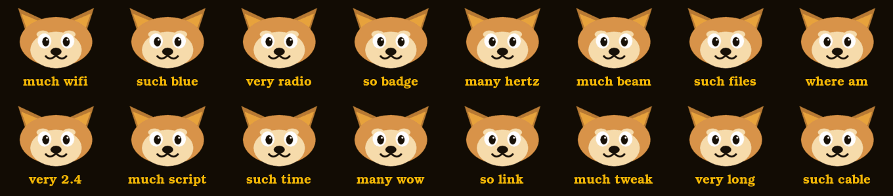

# Doge



Shiba Inu meme theme. Doge gold on near-black, every menu icon is the dog, and the
labels are in doge-speak — `much wifi`, `such files`, `where am`, `very long`.

## Install

Copy this whole folder to your SD card or LittleFS, then on the device:
**Config → UI Theme → (choose FS) → `doge.json`**

Image paths resolve relative to the `.json`, so keep the folder together.

## Palette

| | Hex | Stored as | Where it shows |
|---|---|---|---|
| Primary | `#F2B705` | `f5a0` (RGB565) | titles, selection, borders |
| Secondary | `#8C6A28` | `8b45` (RGB565) | unselected submenu items |
| Background | `#120C04` | `1060` (RGB565) | everything behind |
| LED | `#F2B705` | `F2B705` (24-bit) | breathing, 70% brightness |

The LED value is plain 24-bit RGB — Bruce reads UI colors as RGB565 and the LED color
as ordinary hex out of the same file.

`label` is `0` because each icon already carries its own caption; leaving it at `1`
would draw the menu name a second time underneath.

## Contents

`doge.json`, sixteen 160x140 menu icons, and `boot.png` (300x170) as the boot splash.
`doge-face.png` is the source artwork the icons are composed from — not referenced by
the theme, kept so the set can be regenerated or extended.

Everything here is drawn from geometric primitives via ImageMagick rather than traced
from any photograph, so there's no third-party image to attribute. "Doge" refers to the
2013 meme; this theme is a homage and carries no affiliation with anyone.

## Regenerating

The icons are the face composited with a caption per menu key:

```sh
convert -size 160x140 xc:none \
  \( doge-face.png -resize 150x96 \) -gravity north -geometry +0+6 -composite \
  -font Bookman-Demi -pointsize 19 -fill '#F2B705' \
  -gravity south -annotate +0+8 "much wifi" wifi.png
```

Then flatten to 8-bit to keep them small — the set is ~2 KB per icon:

```sh
convert wifi.png -strip -depth 8 -colors 64 PNG8:wifi.png
```
